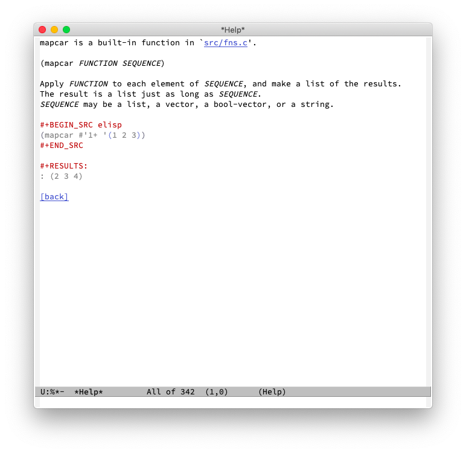

# Elisp API Demos [](https://travis-ci.org/xuchunyang/elisp-demos) [](https://melpa.org/#/elisp-demos) [](elisp-demos.org)

Showing an Elisp demo of `mapcar` in `C-h f mapcar`:



## Usage

To inject elisp demos into `*Help*`, such as `C-h f` (`M-x describe-function`), use

``` emacs-lisp
(advice-add 'describe-function-1 :after #'elisp-demos-advice-describe-function-1)
```

If you use [Helpful](https://github.com/Wilfred/helpful), use

``` emacs-lisp
(advice-add 'helpful-update :after #'elisp-demos-advice-helpful-update)
```

## Contributing

Put your awesome Elisp demos into [elisp-demos.org](elisp-demos.org). A demo is simply an Org heading. Here is `mapcar`'s.

``` org
* mapcar

#+BEGIN_SRC elisp
(mapcar #'1+ '(1 2 3))
#+END_SRC

#+RESULTS:
: (2 3 4)
```

You can use `M-x elisp-demos-add-demo` to insert a new demo or edit an existing one.
